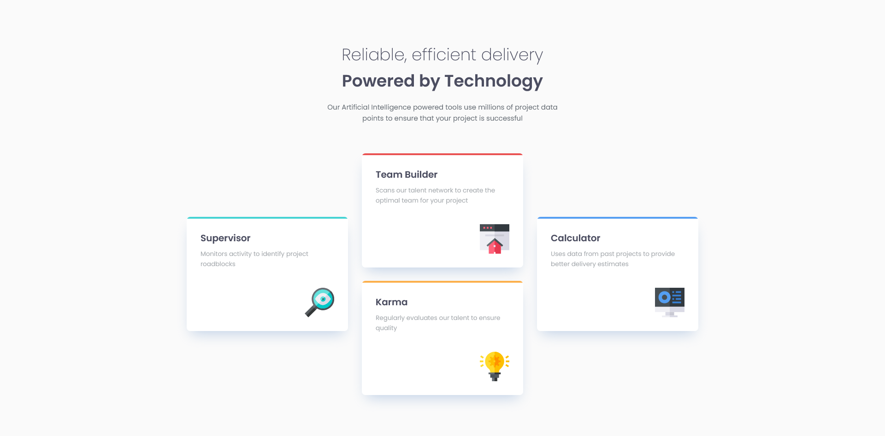

# Frontend Mentor - Four Card Feature Section solution

This is a solution to the [Four Card Feature Section challenge on Frontend Mentor](https://www.frontendmentor.io/challenges/four-card-feature-section-weK1eFYK). Frontend Mentor challenges help you improve your coding skills by building realistic projects. 

## Table of contents

- [Overview](#overview)
  - [The challenge](#the-challenge)
  - [Screenshot](#screenshot)
  - [Links](#links)
- [My process](#my-process)
  - [Built with](#built-with)
  - [What I learned](#what-i-learned)
  - [Continued development](#continued-development)
- [Author](#author)

## Overview

### The challenge

Users should be able to:

- View the optimal layout for the site depending on their device's screen size.

### Screenshot



### Links

- [Solution URL](https://github.com/Kking927/four-card-feature-section)
- [Live Site URL](https://kking927.github.io/four-card-feature-section/)

## My process

### Built with

- Semantic HTML5 markup
- CSS custom properties
- CSS Grid
- Flexbox
- Mobile-first workflow
- CSS Clamp for fluid typography and sizing

### What I learned

**Scoped CSS Variables:** Instead of writing unique hover and border rules for each of the four colors, I used scoped CSS variables. By defining `--accent-color` and `--glow-color` within the individual color classes, I was able to use a single set of rules to handle all card states:
```
.card::before { 
  background-color: var(--accent-color); 
}

.card:hover { 
  box-shadow: 0 20px 40px -10px var(--glow-color); 
}

.card:active { 
  box-shadow: 0 5px 15px -5px var(--glow-color); 
}
```

**Glow Hover Effect:** I created a hover glow effect by matching the box-shadow hue to each card’s specific accent color using HSLA. Setting the alpha channel to 0.4 ensures the shadow is semi-transparent, resulting in a subtle, soft glow."
```
.cyan { --accent-color: var(--cyan); --glow-color: hsla(180, 62%, 55%, 0.4); }
.red { --accent-color: var(--red); --glow-color: hsla(0, 78%, 62%, 0.4); }
.orange { --accent-color: var(--orange); --glow-color: hsla(34, 97%, 64%, 0.4); }
.blue { --accent-color: var(--blue); --glow-color: hsla(212, 86%, 64%, 0.4); }
```

**Auto-Margins in Flex/Grid:** I used `margin-block-start: auto;` on the icon container, to anchor the icons to the bottom-right of the card, ensuring a consistent layout regardless of text length.

**Fluid Sizing with clamp():** I used `clamp()` for the icon widths, allowing them to scale smoothly between `40px` and `64px` without the need for extra media queries.

### Continued development

**Grid Area Naming:** While I used shorthand grid properties here, I want to practice grid-template-areas to make complex layouts more readable and easier to reorder on different screens.

**Advanced Micro-interactions:** I want to learn more about using animations effectively. I’m interested in finding the right balance between making a site feel more interactive and intuitive, while ensuring the effects are smooth, purposeful, and improve the overall user experience. 

## Author

- Frontend Mentor - [@Kking927](https://www.frontendmentor.io/profile/Kking927)
